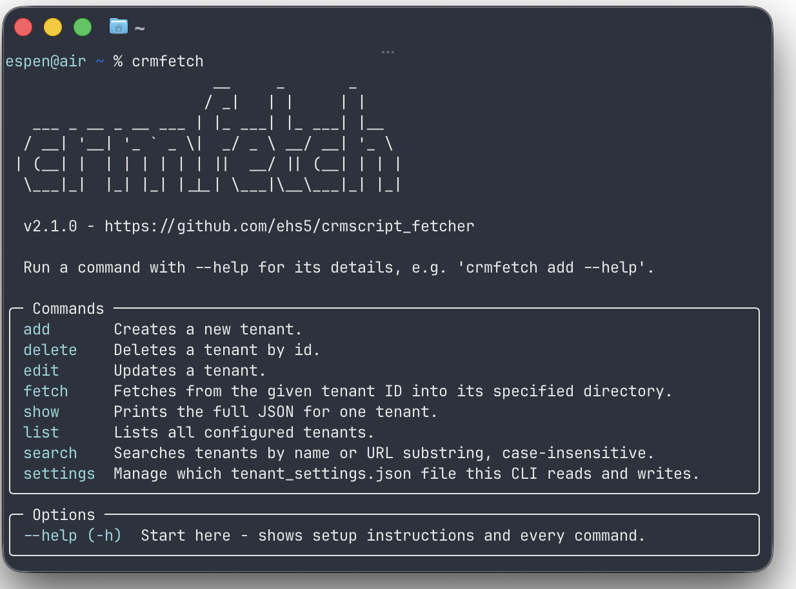

# CRMScript Fetcher

CRMScript Fetcher is a CLI + GUI tool that can download CRMScripts and other data from your 
SuperOffice installations, and create the data as files within a 
folder structure on your local PC.




## About


CRMScript Fetcher is useful for downloading your current scripts and other data such as screens
and scheduled tasks into a local repository, which you then may use for pushing into GitHub/Gitlab etc. 
with your preferred git client.

When fetching, it will create the following folders inside your chosen directory:
- Scripts
- Triggers
- Screens
- ScreenChoosers
- Scheduled tasks
- Tables

Inside these folders, scripts will be created as files with a .crmscript file extension.
Metadata will be created as .json files. 

CRMScript Fetcher aims to recreate the same folder structure as you see in SuperOffice, as far as possible.

> :warning: **When fetching, all files and folders within the folders
> Scripts, Triggers, Screens, ScreenChoosers, Scheduled tasks and Tables
> WILL be deleted if they are not present in SuperOffice.**
> 
> 
> This also includes files/folders that weren't created by CRMScript Fetcher to begin with, so it is not
> advisable to put anything there manually.
> 
> However, files/folders within the root directory will not be deleted, so you can put stuff there safely.

#### About the temp backup folder
Each fetch will create a "temp" folder where your current fetcher-created folders are moved into,
as a failsafe in case the fetch fails during its execution.
The temp folder will be deleted again upon completing the fetch, so you shouldn't normally see it.

If something does go wrong, you can move the contents of temp back into the root folder.

Sometimes, the temp folder might not be deleted correctly due to Windows permission
errors. Usually this works itself out by running the fetch again.

## Prerequisites

- A SuperOffice installation with Service and Developer Tools
  - Only tested on Online so far, but should work on an "on premises" installation as well.


- A local PC running Windows or macOS
  - Tested on Windows 11 and macOS Tahoe only. 

## Getting Started (GUI)

1. Head over to Releases on the right-hand side and download the zip for your OS (macOS or Windows).

2. Unpack it wherever you want.

### How to use

1. Run CRMScript Fetcher.exe

2. Click the "Copy Fetcher Script" button.

3. In your SuperOffice installation, create a new script and paste the contents.
Give it an "include name" (e.g. "crmscript-fetcher") and a secret key.

4. Click "Add tenant"
   - Tenant name: Friendly name of the installation
   - SuperOffice Service URL: For Online environments this will be something like
https://online.superoffice.com/CustXXXXX/CS
   - Script include ID: Your include name
   - Script key: Your secret key
   - Local directory: Click Browse to pick your directory where the folders will be created.

5. Click Save settings

6. Click Fetch CRMScripts to fetch!

All your tenant settings will be saved locally in the tenant_settings.json file.

## Getting Started (CLI)

Using the CLI requires the Python package manager [uv](https://docs.astral.sh/uv/). Install that first if you don't have it already.

Then run:

```bash
uv tool install git+https://github.com/ehs5/crmscript_fetcher.git
```

Verify it was installed correctly by running crmfetch in a new terminal window:


```bash
crmfetch
```

### How to use

Begin with running **crmfetch --help** in your terminal. It will instruct you on what to do first. Most important is creating or pointing to an existing tenant_settings.json file on your machine.

If you already have a tenant_settings.json file since you use to the GUI, you should point the CLI to that file.

## Development

The app contains three part:

**core:** Python code that does the fetching and maintains tenant settings. Is used both by gui and cli.

**gui:** The desktop app made in Vue The app uses pywebview to serve the Vue app and allow the Vue frontend talk to the Python code.

**cli:** A CLI implementation made in Python.

### How to Build

PyInstaller can't cross-compile, so each of these must be run natively on its own OS.

**Windows:**

```powershell
.\build-windows.ps1
```

This first builds the Vue frontend, then packages the Python GUI app. It creates **dist/CRMScript Fetcher/CRMScript Fetcher.exe**.

**macOS:**

```bash
./build-macoS.sh
```

This first builds the Vue frontend, then packages the Python GUI app. It creates **dist/CRMScript Fetcher.app**.

Both builds are GUI-only - there's no bundled CLI executable. See Getting Started (CLI) above for
installing `crmfetch` via `uv` instead.

## Built With

- Python
- pywebview - a framework that lets frontend interact with Python code in-process
- Vue.js
- CRMScript (fetcher script)

## Authors

* **Espen Steen** - [ehs5](https://github.com/ehs5/)

## Acknowledgments
Inspired by:
* [ExpanderSync by Kodesentralen](https://github.com/Kodesentralen/ExpanderSync)
